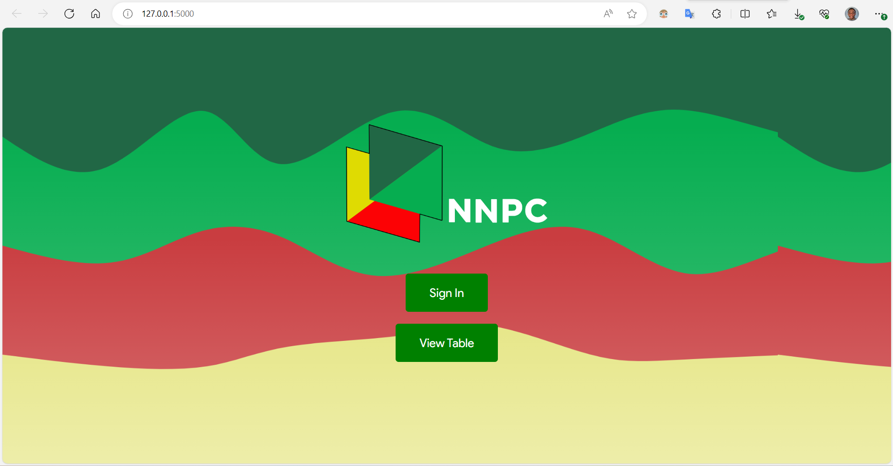
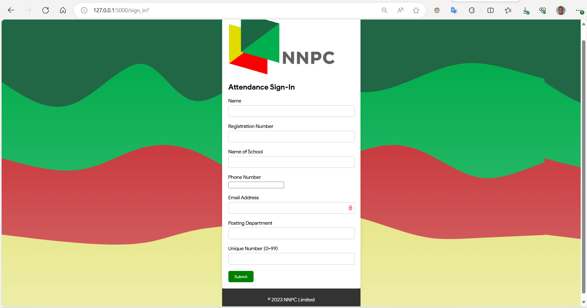
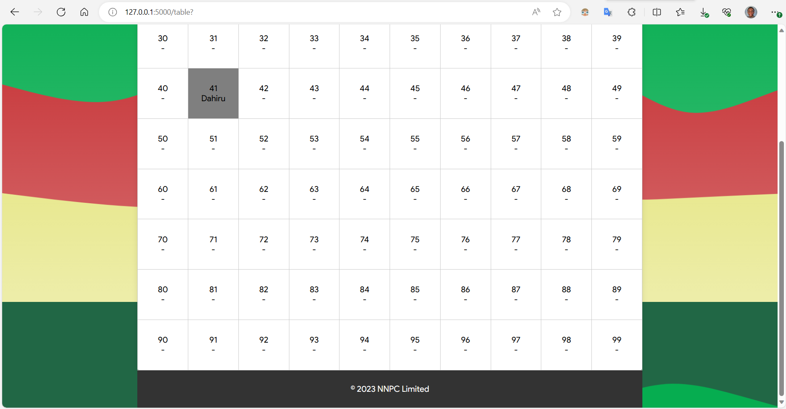

# NNPC Intern Attendance

Interns at the NNPC towers are expected to undergo the following process every morning

- Check in physically at an office
- Self-assign a random number from a printed sheet of paper
- Use the assigned number as an unique ID when signing in online

Only problem is, NNPC towers is a very large place, moving from location A to location B can be very tedious. This project was as a learning experiment with Flask and if it solves the distance problem...added bonus! It replicates the process, only fully remotely.

# Installation

```bash
python index.py
```

# Built Using

- Flask
- HTML
- CSS

# Demo

### Home Page


### Sign In Page


### Table

