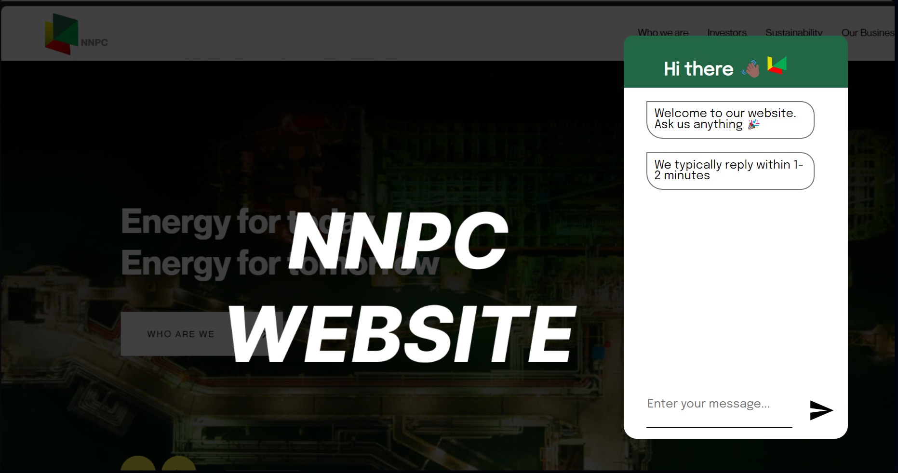
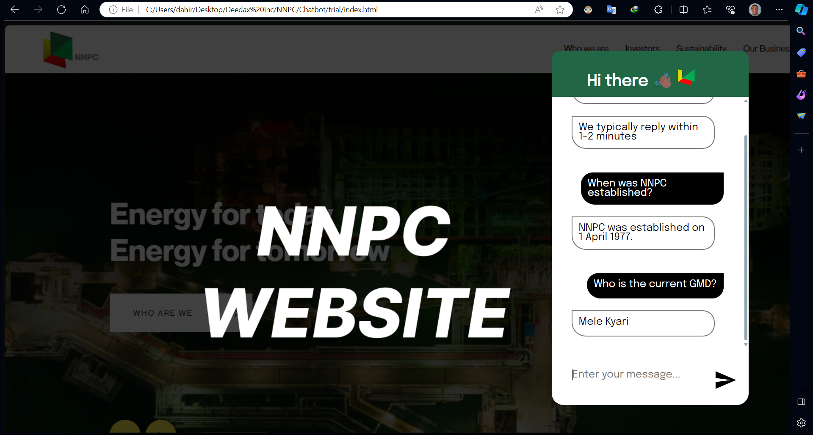

# NNPC Chatbot

This is a an intelligent chatbot powered by LLaMA 2 | OpenAI GPT 3.5. It is able to pull accurate data relevant to a users question from a [knowledge base](NNPC_Knowledge_Base.txt) when necessary. This mechanism is used to reduce an LLMs tendency to produce false information.

# Built with

- Python
- [OpenAI](https://openai.com/)
- [CodeLLaMA 7B](https://huggingface.co/codellama)
- [Sentence Transformers](https://huggingface.co/sentence-transformers)
- [FastAPI](https://fastapi.tiangolo.com/)
- [ChromaDB](https://www.trychroma.com/)
- [Ngrok](https://ngrok.com/)

# Setup & Prerequisites

The Chatbot can be powered by either LLaMA or OpenAI's GPT 3.5.

- For LLaMA 2, ensure that your environment is using a GPU-runtime.
- For OpenAI, ensure that you have a valid OpenAI key.

1. Install all dependencies

```bash
pip install nltk fastapi openai uvicorn pyngrok gradio unstructured gdown PyPDF2 sentence_transformers chromadb git+https://github.com/huggingface/transformers.git@refs/pull/25740/head accelerate tqdm
```

2. Configure ngrok

```bash
ngrok config add-authtoken XXXXXXXXXXXX
```

3. Get free public link for your app

```bash
python -c "from pyngrok import ngrok; ngrok.connect(8000)"
```

4. Run app

```bash
python app.py
```

5. Replace the url in line 23 in [script.js](trial/script.js) with the public url gotten from `ngrok`. 

6. (Optional) Paste your OpenAI API key in line 28 in [script.js](trial/script.js)

7. Open [trial/index.html](trial/index.html) in your browser

# Usage

> Interact with the Chatbot



> Example chat

