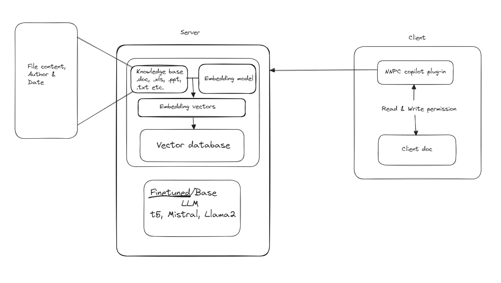
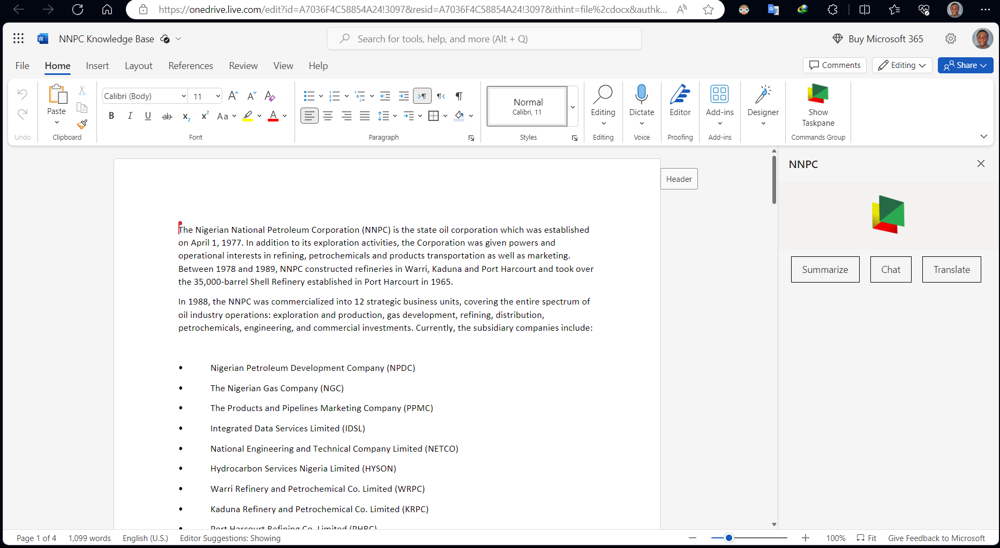
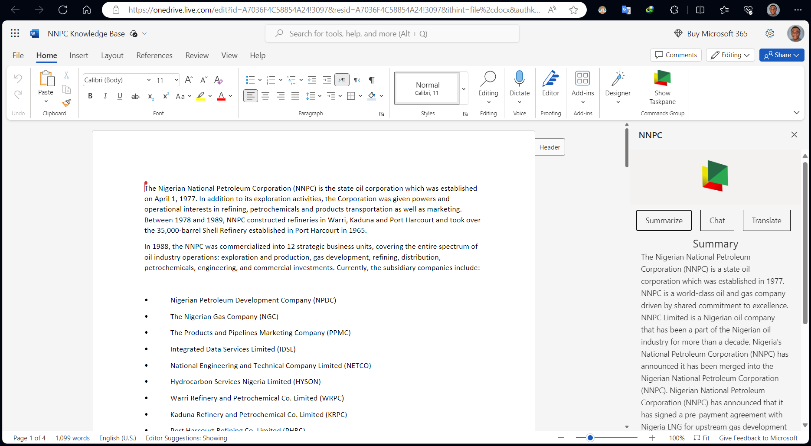

# NNPC Office Plugin

This project was built to enhance the productivity of NNPC officials by integrating intelligence in their workflow, specifically in the company's Microsoft Office Productivity Suite. The goal is to have a Microsoft Copilot-like experience that is tailored uniquely to the company's data. The idea is to give officials the ability to interact naturally with official documents, making information digestion fast and efficient. See image below.



# Built with

- [Yeoman Generator for Office Add-ins](https://github.com/OfficeDev/generator-office)
- [Google Flan T5](https://huggingface.co/docs/transformers/en/model_doc/flan-t5) 
- [FastAPI](https://fastapi.tiangolo.com/)
- [Ngrok](https://ngrok.com/)
- [NodeJS](https://nodejs.org/en)

# Setup & Prerequisites

1. Install all dependencies

```bash
pip install nltk fastapi openai uvicorn pyngrok gradio unstructured gdown PyPDF2 sentence_transformers chromadb git+https://github.com/huggingface/transformers.git@refs/pull/25740/head accelerate tqdm
```

2. Configure ngrok

```bash
ngrok config add-authtoken XXXXXXXXXXXX
```

3. Get free public link for your app

```bash
python -c "from pyngrok import ngrok; ngrok.connect(8000)"
```

4. Run app

```bash
python app.py
```

5. Start the local web server and sideload your add-in.
- Local

```bash
npm start
```

-  Web
```bash
npm run start:web -- --document {url}
```

> Note: Replace "{url}" with the URL of a Word document on your OneDrive or a SharePoint library to which you have permissions

# Usage

By now, an Office Word window should be opened, choose the Home tab, and then choose the Show Taskpane.



To summarize a document, simply click the summarize button in the add-in

